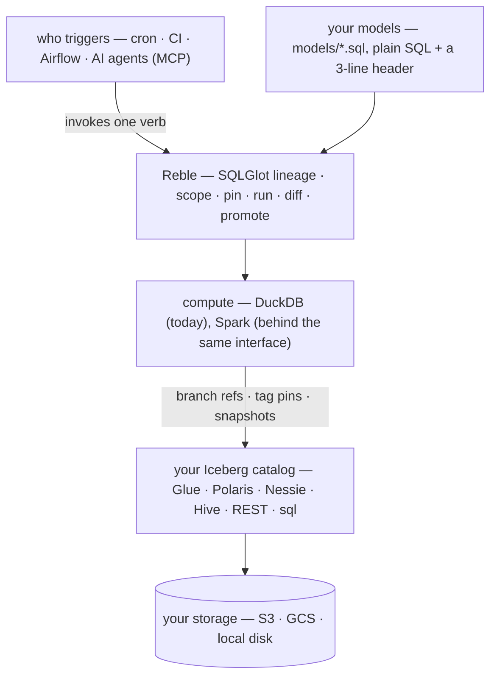
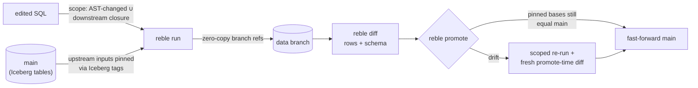

# Reble

[](https://github.com/satya1395/reble/actions/workflows/ci.yml)
[](https://pypi.org/project/reble/)
[](LICENSE)

*Reble* — pronounced **re-bl** (the final *e* is silent).

**Reble is an open SQL engine for your Iceberg lakehouse.** Your models are
plain SQL files; Reble derives their dependencies, builds the tables into
your catalog and bucket, and refreshes exactly what moved — triggered by
cron, CI, Airflow, or an agent. And the engine is branch-capable at the
core: every change can run on an isolated zero-copy branch where you
review the exact rows it changes, then fast-forward production. No
warehouse server, no clones, no merges.

Most teams assemble this from parts — a scheduler to run SQLs in order, a
transformation tool to manage them, and, when a change needs testing, a
copy of the warehouse. Reble is one open layer for the whole job, and the
branching isn't bolted on: scope, pin, run, diff, promote are what the
engine does. A branch contains only the change's blast radius — your
edited models plus their downstream closure — as native Iceberg branch
refs that cost nothing to create.

## How it works



Reble owns the *transformation* layer — models, lineage, execution,
branching — the shape dbt-core has, without the templating or YAML. It
does **not** own *scheduling*: cron or Airflow decides when; Reble is the
step they run. And it's built on **native Iceberg branch refs** — a
per-table Iceberg spec feature supported by any catalog (Glue, Polaris,
Nessie, Hive, or any REST-compliant catalog). It is *not* a catalog and
requires no new infrastructure. A branch ref is metadata-only: zero bytes
are copied.

## Quick start

```
pip install reble
reble init                # writes reble.yml; probes your catalog
git switch -c fix-orders  # or: --change-set agent-42 — git is one adapter
# ...edit two models...
reble run                 # → data branch: edited models + downstream closure
                          #   written; upstream inputs pinned via Iceberg tags
reble diff                # schema + row-level diff vs. branch base
reble status              # un-run edits, drifted pins, branch age/expiry
reble promote             # fast-forward if base is current; forced re-run with
                          #   fresh diff if main moved. No merge. Ever.
```

## What Reble is — and isn't

- **Is:** a transformation engine (models + lineage + execution) that works
  with the Iceberg catalog you already run (Glue, Polaris, Nessie, Hive,
  any REST catalog). No server, no new infrastructure.
- **Isn't:** a scheduler (cron/Airflow's job — Reble is the step they run),
  a catalog, or a merge tool. There is no
  three-way data merge, ever — a change is either fast-forwarded or re-run.
- See [how Reble compares](https://satya1395.github.io/reble/comparisons/)
  to lakeFS, Nessie, and warehouse clones.

## The loop in detail



- **Scoped branching** — scope = edited models ∪ downstream closure, capped
  by `--depth`; `reble run --refresh` scopes by *data* movement instead
  (nightly refreshes rebuild exactly what ingested).
- **Pinned inputs** — upstream tables pinned with Iceberg **tags**
  (`reble_pin__*`) at run time; tags block `expire_snapshots`, so branch
  reads stay correct even while main moves.
- **Row-level diffs** — computed on your compute via DuckDB, streaming
  through `iceberg_scan` (out-of-core; spills under a configurable
  `engines.duckdb.memory_limit`).
- **Promote semantics** — fast-forward only when every pinned base still
  equals current main; otherwise a scoped re-run and a fresh, promote-time
  diff. The PR diff is advisory; the promote diff is authoritative.

## Performance

Measured, reproducible, no clusters — full numbers and reproduction
commands on the [performance page](https://satya1395.github.io/reble/performance/):

- **Branch a 5M-row table: < 10 ms.** Branches are metadata-only.
- **Full lifecycle on AWS (Glue + S3, 1M rows, from a laptop):** scoped
  run ~13 s, keyed diff ~4 s, drift check ~2 s — with streaming reads
  verified engaged (`iceberg_scan`, zero fallbacks).
- Reads spill under a configurable `memory_limit` — working set bounded by
  config, not by RAM.

## Models are plain SQL

**"Model" is just our word for one SQL file that creates one table.** If
your team keeps a folder of SQLs and schedules them some way — a DAG, cron,
an internal webapp — you already have models; point Reble at the folder.
No orchestrator required, no dbt required: `models/**/*.sql`, one file is
one model, the file stem is the table name, and a minimal header comment
block carries the semantics:

```sql
-- model: mart_orders      (optional; defaults to file name)
-- kind: table | view | incremental
-- key: order_id           (diff key; required for incremental)
select ... from stg_orders join raw_customers using (customer_id)
```

Lineage is parsed with SQLGlot: a table reference that matches another model
is an edge; anything else is an upstream input, pinned with an Iceberg tag at
run time. Cosmetic edits (whitespace, comments, casing) hash identically on
the canonical AST and never trigger a run. Every branch snapshot carries
provenance (`reble.model`, `reble.ast_hash`, `reble.run_id`) in its summary —
"which code produced this table state" is answered from the catalog itself.

## Runs itself — no manual runs required

The verbs are idempotent and the exit codes are a contract, so any job can
drive Reble: scheduled, or triggered by whatever lands your data. A double
trigger is harmless — a quiet night computes an empty scope from one
catalog listing.

```yaml
# .github/workflows/refresh.yml — rebuild exactly what moved, nightly and
# on demand (your ingestion job can dispatch it when new data lands)
on:
  schedule: [{cron: "0 3 * * *"}]
  workflow_dispatch:
jobs:
  refresh:
    runs-on: ubuntu-latest
    steps:
      - uses: actions/checkout@v4
      - run: pip install reble
      - run: reble run --refresh     # + reble gc to drop expired branches
        env: { REBLE_CHANGE_SET: local }   # catalog/warehouse creds as secrets
```

PRs get the same treatment: `reble status` exits 3 on drift and
`reble diff` prints the row-level consequences — cheap checks to wire into
any CI.

## Agents (MCP)

Any MCP host can drive the same verbs — the agent has no special powers:

```json
{
  "mcpServers": {
    "reble": {
      "command": "reble-mcp",
      "env": { "REBLE_PROJECT_DIR": "/path/to/project" }
    }
  }
}
```

Install with `pip install 'reble[mcp]'`. `reble_run` generates and returns a
change-set id; errors carry the spec exit codes as structured `error.code`
(3 = drift, 4 = promote-blocked). Tool docstrings are the agent-facing spec.

Agents and CI are first-class everywhere, not just over MCP: every command
speaks a stable [`--json` envelope](SPEC.md) with documented exit codes,
`run`/`diff` stream versioned [`--events`](SPEC.md#event-streams) (NDJSON),
and work is keyed by change-set (`--change-set <id>` or `REBLE_CHANGE_SET`)
so it never depends on git — `--branch` resumes an existing data branch
under a new change-set.

## Documentation

- [**Docs site**](https://satya1395.github.io/reble/) — getting started,
  concepts, comparisons, and the command reference.
- [`SPEC.md`](SPEC.md) — normative CLI specification (v0.2): invariants,
  on-disk layout, `reble.yml` schema, command reference, JSON envelope,
  event streams, provenance, exit codes.
- [`DECISIONS.md`](DECISIONS.md) — recorded behavior decisions.

## Requirements

- Python 3.10+
- An Iceberg catalog (Glue, Polaris, Nessie, Hive, or any REST-compliant
  one) — on AWS, `pip install 'reble[aws]'` and see the
  [AWS quickstart](https://satya1395.github.io/reble/aws/)
- SQL models under `models/` (path configurable via `lineage.models_path`)

## Roadmap to 1.0

| Release | Theme | Highlights | Status |
| --- | --- | --- | --- |
| 0.4 | Runs on AWS | Glue + S3 verified end-to-end, credential auto-config, self-cleaning AWS smoke | ✅ shipped |
| 0.5 | Bigger warehouses | Spark runner (local first, then serverless); GCS + ADLS verification; partitioned tables | next |
| 0.6 | Team workflows | Documented CI recipes (PR checks, promote gates); multi-writer etiquette; `reble doctor` | planned |
| 0.7 | Interop | REST catalogs verified (Polaris, Nessie); Trino read adapter on demand; Iceberg views | planned |
| 0.8 | Operations | Metrics/log hooks; `estimate` v2; Windows support | planned |
| **1.0** | **GA** | See criteria below | — |

**GA criteria** — 1.0 ships when, not before: the JSON envelope, event
streams, and exit codes have held stable through a full minor release;
the lifecycle is green in CI on Glue + one REST catalog + sql; both
engines (DuckDB, Spark) are real; at least three non-trivial warehouse
deployments have run promote in production; and a security pass is done.

## License

Apache-2.0.
