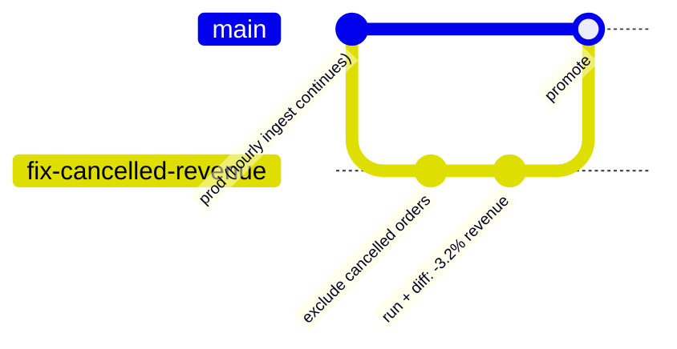
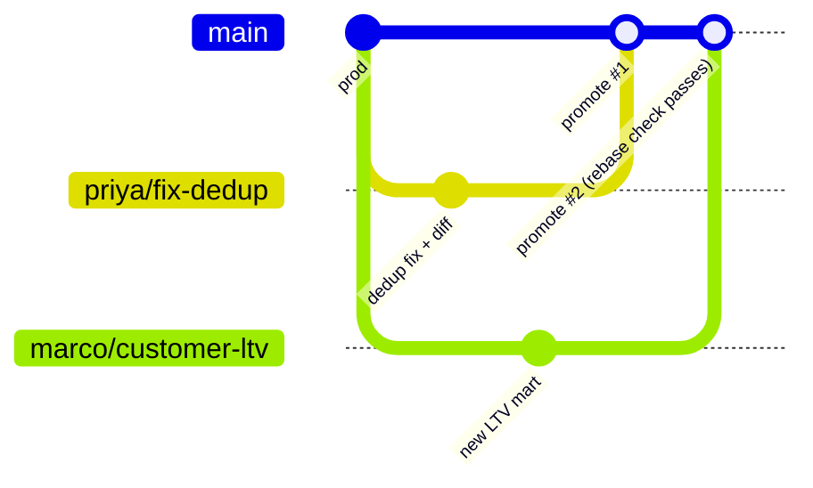

# Reble

[](https://github.com/satya1395/reble/actions/workflows/tests.yml)
[](https://pypi.org/project/reble/)
[](LICENSE)
[](https://cla-assistant.io/satya1395/reble)

**Your models are just SQL files. Your bucket is the warehouse. Any machine
with the CLI and bucket credentials is a full query engine.**

Branch your warehouse like you branch your code — no warehouse server to run,
scale, or pay for.

```sql
-- models/demo/orders_clean.sql      ← filename = table name. That's the whole format.
SELECT id, amount FROM raw.orders WHERE amount > 0
```


<sub>Prefer stills? The full [CLI output design](docs/assets/cli-design.png) shows every command's output on one page ([HTML source](docs/assets/cli-design.html)).</sub>

No `MODEL(...)` headers. No Jinja `{{ ref('...') }}`. No per-model YAML. Dependencies,
column lineage, and change detection are read from the SQL you already wrote — powered by
[SQLGlot](https://github.com/tobymao/sqlglot), the parser underneath the ecosystem's
lineage tooling. A model with no config is a FULL rebuild; the few models that need
more (incremental, in v0.2) get a couple of lines in the one `reble.yml` the project
already has — never boilerplate per model.

Reble is a single CLI that gives a data team — three people or three hundred — a
complete analytics platform: what's sized is the *run*, not the org. Each run is
one fast node over just the tables it touches —
DuckDB + Apache Iceberg + SQLGlot-powered transforms, pre-wired — with subset
branching of the warehouse and branch-per-PR CI for data pipelines. Data lives in
S3/GCS (or on local disk while you're trying it out); the query engine is DuckDB
embedded in the CLI, so your laptop and your CI runners *are* the compute — for
exactly as long as a run takes, and never a second of billing after.

> ⚠️ **Status: pre-alpha, but real.** The full loop works today — `init → run →
> branch → run → diff → promote`, both git orders, with 53 passing tests —
> `pip install reble` and go. The engine is the
> [spike-validated](spikes/04-sqlglot-direct/RESULTS.md) SQLGlot-direct core:
> models are plain SQL files, exactly as described below. Feedback is the most
> valuable contribution — open a Discussion.

**→ [Why Reble exists](docs/why.md)** — the full story: the four gaps in data
engineering workflows, why existing tools don't close them, and why now.
**→ [Coming from dbt?](https://github.com/satya1395/jaffle-shop-classic#coming-from-dbt-the-translation-table)** —
dbt's own jaffle shop ported to Reble, with the translation table and FAQ
(short version: *branches replace environments — there's nothing to configure*).

## The idea

Testing a data pipeline change today means cloning or rebuilding an entire dev
warehouse — even when your change touches three tables. Reble branches **just the
tables you're changing**:

```bash
pip install reble
reble init my-warehouse
git switch -c fix-orders                # branch your code like you always do…
# edit your models…
reble run                               # …and the data branch appears: named after
                                        # your git branch, scope + pins inferred
                                        # (edited models, downstream cascade,
                                        # upstream inputs frozen at the epoch);
                                        # writes go to zero-copy Iceberg branch refs
reble diff                              # schema + row-level diff vs your branch base
reble promote                           # atomic fast-forward to main, clean up
```

**One branch gesture, two artifacts.** Your git branch tracks the code change; the
data branch that follows it holds the change's blast radius. No environments to
configure, no branch names to invent twice. Not in a git repo (or set
`git_sync: false` in reble.yml)? `reble branch create <name>` does the same thing
explicitly — reble reads git state but never runs a git command for you.

Both git orders work: edit-first (scope inferred from the diff) or branch-first
(empty scope + frozen epoch; the scope grows automatically at first run, and reads
resolve as of the moment you branched). And when you come back to a branch after
two weeks, `reble status` is the "where was I?" answer: what you edited but haven't
run, which pinned inputs moved on main under you, what commit the data reflects,
when the branch expires. Every read command takes `--json` for scripts and bots.

- **Zero-copy branches** — branched tables use native Iceberg refs (copy-on-write);
  a branch of a 10GB table costs ~nothing until you write.
- **Pinned inputs** — unbranched tables are read at their snapshot from branch-creation
  time, so your test inputs don't drift while prod keeps ingesting.
- **Row-level diffs** — answer the question every reviewer actually has: *what rows
  does this change?*
- **Column-level lineage & change detection** — inferred from your SQL via SQLGlot:
  only changed models run (cosmetic edits don't count — hashing is on the canonical
  AST), and downstream impact is shown before you apply.
- **No merge, ever** — branches are ephemeral: create, test, promote (fast-forward or
  re-run) or discard. Reble refuses to build last-write-wins data merges.

---

## Four days you've had

The same loop, in scenarios every data engineer has lived through. All CLI output
below is the real tool's output format. The example warehouse:

```
raw.orders                 ← ingested hourly by Airbyte
raw.customers              ← ingested nightly
core.stg_orders            ← staging model
core.stg_customers         ← staging model
core.fct_revenue_daily     ← the table finance actually looks at
core.mart_exec_dashboard   ← reads fct_revenue_daily
```

### 1. "Finance says revenue is wrong" — changing a metric definition

Cancelled orders are being counted as revenue. The fix is one line in `stg_orders` —
but `fct_revenue_daily` and `mart_exec_dashboard` are downstream, and finance will
ask exactly one question: *how much does this change the numbers?*



```console
$ vim models/core/stg_orders.sql   # ... WHERE status != 'cancelled'

$ git switch -c fix-cancelled-revenue
$ reble run
⎇ main → fix-cancelled-revenue · data branch created from your git branch
  scope  core.fct_revenue_daily, core.mart_exec_dashboard, core.stg_orders  inferred from your changes
  pins   raw.orders  upstream inputs, frozen now
⎇ fix-cancelled-revenue
  changed    core.stg_orders, core.fct_revenue_daily, core.mart_exec_dashboard
  published  core.stg_orders, core.fct_revenue_daily, core.mart_exec_dashboard → branch ref
✓ 3 models in 0.2s
```

Notice what you didn't do: create a branch in reble, or enumerate the downstream
cascade. The data branch followed your git branch, and the scope came off the
model graph — your one-line edit touches three tables, and the raw input feeding
them is pinned so hourly ingestion can't shift your numbers mid-analysis.
(Prefer it explicit? `reble branch create` still works, and it's the flow for
projects without a git repo.)

```console
$ reble diff
⎇ fix-cancelled-revenue vs base

  core.stg_orders  1,204,331 → 1,168,210 rows · key order_id
    −36,121 removed

  core.fct_revenue_daily  730 → 730 rows · key date_id
    ~214 changed
```

There's finance's answer, before anything touched prod: **36,121 cancelled orders
excluded, revenue restated on 214 of 730 days.** Screenshot the diff, get the
sign-off, then:

```console
$ reble promote
⎇ fix-cancelled-revenue → main
  ✓ core.fct_revenue_daily
  ✓ core.mart_exec_dashboard
  ✓ core.stg_orders
✓ promoted · branch deleted · on main
  your data is on main; git is still on fix-cancelled-revenue — merge or switch when ready
```

**Without branches:** you'd have run this in a shared dev schema (numbers drifting
under you with every hourly ingest), eyeballed two spreadsheet exports, and pushed to
prod hoping.

### 2. Building a brand-new mart (greenfield, branch-first)

You're starting `mart_weekly_retention`. Nothing downstream exists yet, so there's
nothing to diff against — the risks are different: your inputs drifting while you
iterate, and a half-finished table leaking into prod where the BI tool will find it.

Branch first, git-style, *before* writing any SQL:

```console
$ reble branch create weekly-retention
⎇ main → weekly-retention
  scope  open — grows when you edit models and run
  reads  every table frozen as of now (the branch epoch)
✓ switched to weekly-retention
```

Now iterate. Twenty runs over three days while prod ingests hourly — every run
computes against the same Tuesday-9am inputs, so when the retention curve changes,
it's because *your SQL* changed:

```console
$ vim models/core/mart_weekly_retention.sql
$ reble run
⎇ weekly-retention
  changed    core.mart_weekly_retention
  published  core.mart_weekly_retention → branch ref
✓ 1 model in 0.3s

$ reble diff
⎇ weekly-retention vs base

  core.mart_weekly_retention  new table — profile
    rows 53   cols cohort_week timestamp · customers int64 · retained_w1 double · retained_w4 double 5 nulls
```

A profile, not a diff — there's no "before" for a new table. Those 5 nulls in
`retained_w4`? Caught here, not in the exec's dashboard. When it's right, `reble
promote` — and the moment it lands, the new mart is registered in the lineage graph,
so the *next* person who touches `stg_customers` gets warned that your mart reads it.

### 3. Two engineers, two branches, zero coordination

Priya is fixing order dedup in `stg_orders`. Marco is building `mart_customer_ltv`.
Neither knows what the other is doing. Neither needs to.



Their scopes are disjoint — Priya's refs on `stg_orders`+downstream, Marco's on his
new mart — so they work in parallel all week. Promotes go one at a time. Priya
promotes first. When Marco promotes, Reble checks: *do any of Marco's models read the
tables Priya changed?*

- **No** → Marco's promote fast-forwards, done.
- **Yes** (his LTV mart reads `stg_orders`) → promote refuses with instructions:
  rerun against the new main, re-validate, then promote. Never a silent data merge.

The overlap case is caught even earlier — at *creation*:

```console
$ reble branch create also-touching-orders
⎇ main → also-touching-orders
  scope  core.stg_orders, core.fct_revenue_daily  inferred from your changes
  pins   raw.orders  upstream inputs, frozen now
⚠ core.stg_orders is also scoped by branch priya/fix-dedup — second promote will require a rebase
✓ switched to also-touching-orders
```

**Without branches:** Priya and Marco share a dev schema, clobber each other's
tables, and coordinate via Slack messages that start with "hey, are you using...".

### 4. The save — a bad change that never reached prod

You "simplify" a join in `stg_orders`. The SQL looks obviously correct. A reviewer
would have approved it.

```console
$ reble branch create simplify-join
$ reble run
$ reble diff
⎇ simplify-join vs base

  core.stg_orders  1,168,210 → 1,919,630 rows
    +751,420 added   no unique key: changes count as +/− pairs

  core.fct_revenue_daily  730 → 730 rows · key date_id
    ~730 changed
```

**A 64% row explosion — and revenue restated on all 730 days.** The "simplified"
join fans out on duplicate customer keys. Caught on a laptop, on frozen inputs, in
a branch nobody else can see:

```console
$ reble branch delete simplify-join
✓ deleted branch simplify-join
```

Nothing to roll back, nothing to explain in the incident channel, no backfill. The
branch cost ~0 bytes to create and one command to destroy.

**Without branches:** this ships Friday, the weekend batch triples revenue, and
Monday starts with an incident review.

### The pattern

All four are the same loop:

```
(edit ↔ branch, either order)  →  run  →  diff or profile  →  promote or discard
```

Branches are metadata only — zero-copy Iceberg refs plus a frozen epoch. Creating one
is free; deleting one is guilt-free. Inputs never drift, prod is never at risk, and
the diff answers the question reviewers actually ask.

---

## Measured, not promised

The design is validated by reproducible spikes in [`spikes/`](spikes/), including a
full-scale performance run — **140M rows / 10.22GB** on an Apple M4 Pro laptop
(pyiceberg 0.11.1, DuckDB 1.5.5):

| Operation at 10GB scale | Time |
|---|---|
| Create a branch of the 140M-row table | **< 10ms** (zero-copy, size-independent) |
| Pinned full-table scan → Arrow | 4.0s |
| Projected scan (2 of 6 columns) | 0.47s |
| Full diff — both refs scanned, added + changed rows | **5.9s** |
| Branch append (5M rows) | 1.3s |
| Bulk load throughput | ~3.5M rows/s |

Peak RAM 12.3GB, 3.5GB on disk (Parquet ≈ 2.9× compression). Details and the scripts
to reproduce: [spike 1 — branch lifecycle](spikes/01-pyiceberg-branches/RESULTS.md) ·
[spike 2 — performance](spikes/02-perf/RESULTS.md) ·
[spike 4 — the SQLGlot-direct core](spikes/04-sqlglot-direct/RESULTS.md).

## The killer workflow: branch-per-PR — live

**See it running on [dbt's jaffle shop](https://github.com/satya1395/jaffle-shop-classic/pull/1)**:
a one-line fix to `customer_lifetime_value`, and the review comment answers the
only question that matters — *"~6 customers changed, nothing added, nothing
removed"* — computed on a zero-copy branch with epoch-pinned inputs.

On every pull request, [a ~70-line hermetic workflow](https://github.com/satya1395/jaffle-shop-classic/blob/main/.github/workflows/reble-pr.yml)
(no services, no state, copy it into any repo):

1. rebuilds the main baseline from seeds
2. creates a branch scoped to your changed models (inferred — no config)
3. runs only the changed models against epoch-pinned inputs
4. posts the row-level diff as a PR comment

The [jaffle-shop-classic port](https://github.com/satya1395/jaffle-shop-classic)
is also the dbt side-by-side: the original Jinja project and the plain-SQL Reble
port live in the same repo.

## Two modes, one tool

**On-ramp (zero services):** everything on your laptop — DuckDB embedded, Iceberg on
local disk, SQLite catalog, transforms in-process. No Docker, no daemons. This is how
you try Reble in about ten minutes, run its test suite, or run a solo project.

**Production (team mode):** the same project pointed at **S3/GCS + a shared
Postgres or REST catalog** — because that's where real warehouses live. Your laptop
(or a CI runner) stays the query engine.

> ⚠️ **Team mode status — be clear-eyed here.** What's validated today is the
> *single-writer* shape: one person (or one CI job) running the loop over
> S3 ([spike 06](spikes/06-s3-team-mode/RESULTS.md)). **Multiple people writing
> through a shared catalog at once is not supported yet** — branch state is
> per-checkout, there's no promote lock, and concurrent-writer behavior is
> untested. The multi-user design below (local branches, remote main) is
> spike-validated but not wired. If you're a team today: give exactly one
> identity write access and treat everyone else as readers.

**The team flow is the dbt flow.** Edit SQL on a git branch, `reble run` locally
(the data branch appears, inputs frozen), open a PR (the bot posts the row-level
diff), merge — and a prod job runs `reble run` on main, rebuilding exactly the
changed models against current inputs. Nobody types `promote` on a team:
promote is the solo shortcut for publishing an already-computed branch when you
*are* your own prod job.

Where this is headed (design settled, [spike-validated](spikes/07-local-overlay/RESULTS.md),
wiring on the roadmap): **branches are local, main is remote — exactly like git.**
Developers hold read-only credentials to the shared bucket; their data branches
live on their own machines as zero-copy overlays of pinned prod snapshots
(measured: branching a remote 1M-row table locally takes 6ms and copies
nothing, and local writes leave the shared warehouse bit-identical). The only
identity that can write shared main is the merge gate. "Individuals can't touch
prod" becomes an IAM property, not a convention.


*"Local compute" does not mean copying the warehouse.* There is no database
server anywhere: the warehouse is Parquet files in Iceberg layout, and the
query engine (DuckDB) lives inside the CLI. Each `reble run` reads **just what
that run needs** — only the tables your changed models touch, only the columns
their SQL references, at the pinned snapshots — streams it through memory, and
writes results back to the bucket. Nothing is replicated, synced, or stored
locally. It's the same I/O a remote warehouse does internally; the only things
that moved are where the CPU sits, and who bills you for it. The branch machinery doesn't change:
branches and pins are *catalog metadata*, so branching a 500GB table in S3 is the
same instant, zero-copy operation as locally — only scan latency differs, and
lineage-driven column pruning is the mitigation. (Honest status: the full loop is
[validated over MinIO and real AWS S3](spikes/06-s3-team-mode/RESULTS.md) —
per-op latency lands in the hundreds-of-ms band on real S3, fine for
interactive use. Still open: shared-catalog concurrency and large-scan S3
throughput — unmeasured means unclaimed.)

```yaml
# reble.yml — the entire difference between modes
warehouse: s3://my-bucket/warehouse
catalog:
  type: sql
  uri: postgresql://...
```

## What Reble is not

- Not a query engine, storage engine, or table format — it composes DuckDB, Iceberg,
  and SQLGlot and adds the branching layer and glue.
- Not a dbt/SQLMesh replacement you must migrate to all at once — importers
  (`{{ ref('...') }}` and `MODEL(...)` translation) are on the roadmap.
- Reble doesn't compete with Snowflake the product. It competes for the workloads
  that never needed it — and for most pipelines, the honest question isn't
  *"which warehouse?"* but *"does this workload need a warehouse vendor at
  all?"* Compute is one fast node per run over data in your bucket, not a
  cluster.
- Not a full-catalog branching system (see Nessie/lakeFS for that) — Reble branches
  subsets over standard Iceberg catalogs, no migration required.

## Where this is going

Shipped in v0.1.0: **reble follows git** — implicit data branches on `reble run`,
git provenance in `reble status`, `--json` on every read command. Next, in rough
order (opinions welcome in Discussions):

- **`reble branch refresh`** — re-pin a long-lived branch's inputs to now and
  rerun, so a two-week-old branch can catch up to today's data before promote.
- **Team mode: local branches, remote main** — developers get read-only bucket
  credentials and branch locally as zero-copy overlays of pinned prod snapshots
  ([spike-validated](spikes/07-local-overlay/RESULTS.md): 6ms, nothing copied,
  shared warehouse untouched by local writes); only the merge gate writes main.
  AWS S3 Tables (managed Iceberg with a REST catalog) is a candidate shared
  catalog that would mean nothing to host at all.
- **Merge-driven promote** — later, as a pure optimization: skip recomputing an
  expensive model in the prod run when its inputs haven't moved.
- **Incremental models** (v0.2) — a couple of lines in `reble.yml`, never
  per-model boilerplate.
- **dbt/SQLMesh importers** — `{{ ref('...') }}` and `MODEL(...)` translation
  for gradual migration.

## Design docs

- [Why Reble exists](docs/why.md) — motivation and positioning
- [jaffle shop on Reble](https://github.com/satya1395/jaffle-shop-classic) — dbt's example ported, live branch-per-PR, dbt→reble FAQ
- [Architecture](docs/architecture.md)
- [Getting started](docs/getting-started.md)
- [CLI output design](docs/assets/cli-design.png) — every command's output, one page (implemented in v0.0.9)
- [Validated spikes](spikes/) — reproducible proof the core primitives work today

## Contributing

Feedback beats code right now — try the loop on your own models and open a
[Discussion](../../discussions) or an issue. See [CONTRIBUTING.md](CONTRIBUTING.md).

## License

Apache 2.0 — see [LICENSE](LICENSE).
