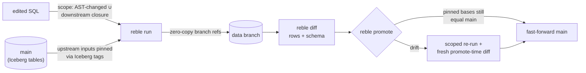

# Reble

[](https://github.com/satya1395/reble/actions/workflows/ci.yml)
[](https://pypi.org/project/reble/)
[](LICENSE)

**Git-style branches for your Iceberg warehouse.** Change a model, run it
on an isolated zero-copy branch, review the exact rows that changed, then
fast-forward production. No warehouse clones, no copies, no merges.

You know this problem: to test a change to one model you either re-run your
pipeline against a copy of the warehouse (slow, expensive, constantly out of
date) or you cross your fingers on prod. Reble gives every change its own
**branch of only the tables it touches** — your edited models plus their
downstream closure — built on native Iceberg branch refs that cost nothing
to create. Before anything reaches production, you see the row-level diff.



## Quick start

```
pip install reble
reble init                # writes reble.yml; probes your catalog
git switch -c fix-orders  # or: --change-set agent-42 — git is one adapter
# ...edit two models...
reble run                 # → data branch: edited models + downstream closure
                          #   written; upstream inputs pinned via Iceberg tags
reble diff                # schema + row-level diff vs. branch base
reble status              # un-run edits, drifted pins, branch age/expiry
reble promote             # fast-forward if base is current; forced re-run with
                          #   fresh diff if main moved. No merge. Ever.
```

## What Reble is — and isn't

- **Is:** a CLI that works with the Iceberg catalog you already run (Glue,
  Polaris, Nessie, Hive, any REST catalog). No server, no new infrastructure.
- **Isn't:** a catalog, an orchestrator, or a merge tool. There is no
  three-way data merge, ever — a change is either fast-forwarded or re-run.
- See [how Reble compares](https://satya1395.github.io/reble/comparisons/)
  to lakeFS, Nessie, and warehouse clones.

## Models are plain SQL

No orchestrator required. `models/**/*.sql` — one file is one model, the file
stem is the model name, and a minimal header comment block carries the
semantics:

```sql
-- model: mart_orders      (optional; defaults to file name)
-- kind: table | view | incremental
-- key: order_id           (diff key; required for incremental)
select ... from stg_orders join raw_customers using (customer_id)
```

Lineage is parsed with SQLGlot: a table reference that matches another model
is an edge; anything else is an upstream input, pinned with an Iceberg tag at
run time. Cosmetic edits (whitespace, comments, casing) hash identically on
the canonical AST and never trigger a run. Every branch snapshot carries
provenance (`reble.model`, `reble.ast_hash`, `reble.run_id`) in its summary —
"which code produced this table state" is answered from the catalog itself.

## How it works

Reble is built on **native Iceberg branch refs** — a per-table Iceberg spec
feature supported by any catalog (Glue, Polaris, Nessie, Hive, or any
REST-compliant catalog). It is *not* a catalog and requires no new
infrastructure. A branch ref is metadata-only: zero bytes are copied.

- **Scoped branching** — scope = edited models ∪ downstream closure, capped
  by `--depth`.
- **Pinned inputs** — upstream tables pinned with Iceberg **tags**
  (`reble_pin__*`) at run time; tags block `expire_snapshots`, so branch
  reads stay correct even while main moves.
- **Row-level diffs** — computed on your compute via DuckDB, streaming
  through `iceberg_scan` (out-of-core; spills under a configurable
  `engines.duckdb.memory_limit`).
- **Promote semantics** — fast-forward only when every pinned base still
  equals current main; otherwise a scoped re-run and a fresh, promote-time
  diff. The PR diff is advisory; the promote diff is authoritative.

## Agents (MCP)

Any MCP host can drive the same verbs — the agent has no special powers:

```json
{
  "mcpServers": {
    "reble": {
      "command": "reble-mcp",
      "env": { "REBLE_PROJECT_DIR": "/path/to/project" }
    }
  }
}
```

Install with `pip install 'reble[mcp]'`. `reble_run` generates and returns a
change-set id; errors carry the spec exit codes as structured `error.code`
(3 = drift, 4 = promote-blocked). Tool docstrings are the agent-facing spec.

Agents and CI are first-class everywhere, not just over MCP: every command
speaks a stable [`--json` envelope](SPEC.md) with documented exit codes,
`run`/`diff` stream versioned [`--events`](SPEC.md#event-streams) (NDJSON),
and work is keyed by change-set (`--change-set <id>` or `REBLE_CHANGE_SET`)
so it never depends on git — `--branch` resumes an existing data branch
under a new change-set.

## Documentation

- [**Docs site**](https://satya1395.github.io/reble/) — getting started,
  concepts, comparisons, and the command reference.
- [`SPEC.md`](SPEC.md) — normative CLI specification (v0.2): invariants,
  on-disk layout, `reble.yml` schema, command reference, JSON envelope,
  event streams, provenance, exit codes.
- [`DECISIONS.md`](DECISIONS.md) — recorded behavior decisions.

## Requirements

- Python 3.10+
- An Iceberg catalog (Glue, Polaris, Nessie, Hive, or any REST-compliant one)
- SQL models under `models/` (path configurable via `lineage.models_path`)

## Status

v0.3 — the full branch → run → diff → promote loop on DuckDB + pyiceberg,
with change-set keying, event streams, catalog-side provenance, the MCP
tool surface for agents, streaming out-of-core reads
(`iceberg_scan` + spill), and `reble estimate`. Branch creation is
metadata-only — measured at <10 ms on a 5M-row table. Next: the Spark
runner.

## License

Apache-2.0.
