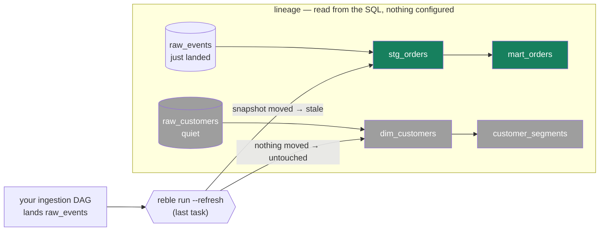

# Airflow

Keep your Airflow. Reble doesn't replace it, wrap it, or sit beside it —
it's the **one command your refresh DAG runs**. Airflow decides *when*
(schedules, retries, alerts); `reble run --refresh` does the refresh:
derives what changed, rebuilds exactly that, in dependency order, into
your Iceberg tables.

If you currently have a task per SQL query, those tasks collapse into
one — the dependency wiring between them stops being something you
maintain, because Reble reads it out of the SQL.

## What happens when the task fails mid-run?

The fear is reasonable: twenty models' worth of tasks collapsed into one
command — so when it fails at model 7, does the retry duplicate data or
re-run everything? Neither:

- **No duplicate data, ever.** Every model materializes as
  replace-never-append, and each table's commit is atomic. A model is
  either fully at its old state or fully at its new one; there is no
  partial write, and there is no append path to double.
- **The retry resumes, not restarts.** Progress is recorded as each model
  commits — a crashed run leaves completed models marked done, so the
  retry executes only what didn't finish. (For `--refresh` this falls out
  of snapshot timestamps: finished models are no longer stale.)
- **Fail-fast.** The run stops at the first failing model; downstream
  models never run against half-built inputs.

So Airflow's retry box just works: `retries=2` on the task, and the
second attempt picks up where the first died.

## The nightly refresh

The whole warehouse, one task:

```python
from airflow.providers.cncf.kubernetes.operators.pod import PodOperator  # or BashOperator
```

```python
from airflow.decorators import dag, task
from pendulum import datetime

@dag(schedule="0 3 * * *", start_date=datetime(2026, 1, 1), catchup=False)
def reble_nightly():
    @task(bash_command="cd /srv/warehouse && reble run --refresh && reble gc")
    def refresh():
        pass

    refresh()

reble_nightly()
```

`--refresh` scopes by data movement, so backfills and manual triggers are
safe: a night with no new data is one catalog listing and a green task;
trigger it twice, nothing doubles.

## Refresh the moment data lands

Make **the last task of your ingestion DAG** the refresh. Lineage — read
from the SQL itself — knows which sources drive which models, so the
refresh rebuilds exactly the chain the ingest touched, and nothing else:



No sensors polling for "is the data there yet", no per-source task wiring:
the moment `raw_events` lands a new snapshot, `stg_orders` is stale by
timestamp — and its downstream closure joins it. `raw_customers`' chain
didn't move, so it isn't read, isn't rebuilt, isn't billed:

```python
ingest >> BashOperator(
    task_id="refresh",
    bash_command="cd /srv/warehouse && reble run --refresh",
)
```

## Task per model — only if you want Airflow's per-task machinery

Reble already executes models in dependency order within a run, so you
don't need a task per model for correctness. Split when you want Airflow's
per-task retries, SLAs, or observability:

```python
build_stg = BashOperator(task_id="stg_orders",
                         bash_command="reble run --models stg_orders")
build_mart = BashOperator(task_id="mart_orders",
                          bash_command="reble run --models mart_orders")
build_stg >> build_mart
```

## Promotion: deploy data changes the way you deploy code

You already run this pipeline for code — build, checks, deploy. With
Reble, the artifact being deployed is **table states**: the data branch
you built is the release candidate, and `reble promote` is the deploy
button. Because it's a task, you can gate it with anything Airflow gives
you:

```python
build = BashOperator(task_id="build",
                     bash_command="reble run")            # branch = release candidate
checks = BashOperator(task_id="checks",
                      bash_command="reble status && reble diff")
gate = ...    # any approval step Airflow supports — pause, external
              # sign-off, a stakeholder check; or nothing, for full auto
promote = BashOperator(task_id="promote",
                       bash_command="reble promote --ff-only")

build >> checks >> gate >> promote
```

Three properties make promote safe as an automated step:

- **It refuses instead of merging.** `--ff-only` exits `4` if production
  moved under the branch. That refusal is the feature — the branch
  re-runs on fresh inputs and re-reviews, rather than resolving conflicts
  at deploy time. There is no merge path to misconfigure.
- **It applies atomically, table by table, and resumes.** Each table's
  fast-forward is atomic; an interrupted promote records per-table
  progress, so a retried task picks up where it died — never
  double-applies.
- **Exit codes are a contract.** `0` success, `3` drift, `4` blocked,
  `6` lineage unresolved — Airflow's trigger rules and short-circuit
  operators branch on them directly.

And the review artifact is the thing reviewers actually want: the gate's
`reble diff` shows the exact rows the change adds, removes, and modifies
— not a wall of SQL.

## Setup notes

- Install Reble on workers or in the image: `pip install reble`
  (or `reble[aws]` on Glue + S3).
- `REBLE_CHANGE_SET` gives each DAG its own key (e.g. `{{ dag.dag_id }}`),
  so scheduled runs, backfills, and manual triggers never collide.
- Credentials are the usual ones — your catalog and storage, via Airflow
  connections or env vars.

## Later: a provider package

A dedicated Airflow provider (operators with structured exit-code
handling, a deferrable run operator streaming `--events` for live
progress, a drift sensor) is planned once there's user pull. Until then
the plain-operator patterns above are the intended interface — the verbs
were designed for exactly this.
