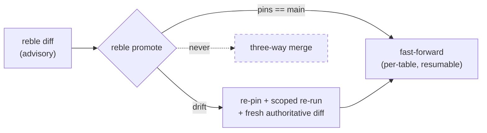

# Concepts

## The problem, more precisely

Data teams can't safely try things. Four gaps compound:

1. **Environments are all-or-nothing.** A staging warehouse is a copy of
   *everything*, so it's expensive enough that you share it — and then you
   queue behind everyone else's experiments.
2. **Test inputs drift.** By the time your change finishes running against
   staging, prod has ingested three more hours of data. Your diff is against
   a world that no longer exists.
3. **"What rows does this change?" has no answer.** Code review sees the
   SQL; nobody sees the 300 rows the new filter silently drops.
4. **The modern stack almost had this.** Iceberg made branching *possible*
   (native branch refs, on any compliant catalog) — but nothing made it
   *usable*. You shouldn't need to run a new catalog server to get a branch.

Reble is the workflow layer on top of that last point: scoped branches,
deterministic inputs, row-level diffs, and a promote you can trust.

## Reble vs Git

If you know git, you already know Reble:

| Git | Reble |
| --- | --- |
| Repository | Iceberg catalog (the one you already run) |
| Branch | Data branch: zero-copy Iceberg refs, per changed table |
| Your working tree | `models/**/*.sql` — plain SQL files |
| `git diff` | `reble diff` — rows, not lines |
| `git status` | `reble status` — un-run edits, drifted pins |
| Commit | A run: scoped materialization on the branch |
| Merge (fast-forward) | `reble promote` |
| `.gitignore` | `.reble/` — machine-local state |
| Merge (three-way) | **Nothing. Deliberately absent.** |

### Where the analogy breaks: merge

Reble has no data merge, and never will. Promote is a **fast-forward** when
the branch's pinned inputs still equal production, and a **scoped re-run**
when they don't. That's the entire decision procedure — no conflict markers,
no resolution semantics, no "trust the tool."

This isn't a missing feature; it's the design. Three-way merges on data
silently corrupt warehouses: when two branches both derive from the same
base, "merging" their outputs requires guessing rows' intent. Refusing to
merge is also what keeps branches *cheap* — you never carry merge debt, so
branches can be short-lived and disposable.

The corollary: the diff you review before promote is **advisory**; the diff
Reble computes *at promote time* (after any forced re-run) is
**authoritative**. If main moved, you re-run and re-review — you never
review a stale diff and then get different rows.

## Scoped branching

A branch contains exactly the change's blast radius:

```
scope = edited models ∪ downstream closure
```

Edited models are detected by hashing the **canonical SQL AST** (via
SQLGlot), so cosmetic edits — whitespace, comments, keyword casing — never
trigger a run. Everything downstream of an edit is pulled in, because a
model whose inputs changed is itself changed. Cap the cascade with
`--depth N` if you want a tighter radius; the cut tables are reported as
stale.

A model may skip a run only when *both* its SQL is unchanged *and* none of
its in-scope parents executed. Unchanged SQL over changed inputs is a
changed table.

## Pinning: why branches are deterministic

When you run on a branch, every **upstream input** (a table that isn't a
model you're branching) is pinned with an **Iceberg tag** at that moment.
Branch reads resolve through the tags — and tags block
`expire_snapshots`, so the pinned data physically cannot disappear while
the branch lives.

This is what makes a branch a *function of one input state* rather than a
snapshot of whatever prod happened to be mid-run. It's also the drift
detector: `reble status` compares each pin to the input's current main
snapshot, and any mismatch (exit code 3) means promote will force a re-run.

## Promote or discard. There is no third option.



Promotion is per-table fast-forwards on vanilla catalogs, with recorded,
re-entrant state — an interrupted promote resumes without re-executing
already-promoted tables. Promotion is also *provenance-carrying*: every
branch snapshot records the model name, AST hash, and run id that produced
it, and that metadata travels with the snapshot to main.

## Branches are ephemeral

Branches are cheap to create and meant to die young: promote them, or
`reble branch discard` them. TTL expiry (`reble gc`) drops stale branches
and — importantly — **orphan pin tags**, which otherwise block snapshot
expiration on production tables. GC in Reble is a correctness command, not
hygiene.

## Not git-coupled

Git is one way to say "this is my change-set." `reble run --change-set <id>`
(or `REBLE_CHANGE_SET`) works identically without a git repo — the default
key for git-less projects is simply `local`. This is the same surface CI
and AI agents use: every verb speaks a stable `--json` envelope with
documented exit codes, and `run`/`diff` emit versioned event streams.
