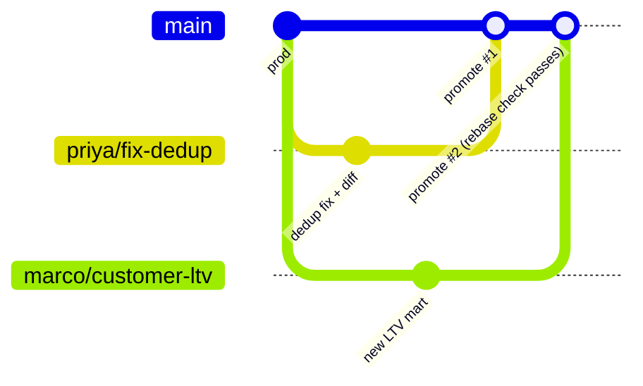

# More days you've had

Continuations of the scenario walkthrough in the
[README](../README.md#four-days-youve-had) — same example warehouse, same
rule: all CLI output is the real tool's output format.

### 2. Building a brand-new mart (greenfield, branch-first)

You're starting `mart_weekly_retention`. Nothing downstream exists yet, so there's
nothing to diff against — the risks are different: your inputs drifting while you
iterate, and a half-finished table leaking into prod where the BI tool will find it.

Branch first, git-style, *before* writing any SQL:

```console
$ reble branch create weekly-retention
⎇ main → weekly-retention
  scope  open — grows when you edit models and run
  reads  every table frozen as of now (the branch epoch)
✓ switched to weekly-retention
```

Now iterate. Twenty runs over three days while prod ingests hourly — every run
computes against the same Tuesday-9am inputs, so when the retention curve changes,
it's because *your SQL* changed:

```console
$ vim models/core/mart_weekly_retention.sql
$ reble run
⎇ weekly-retention
  changed    core.mart_weekly_retention
  published  core.mart_weekly_retention → branch ref
✓ 1 model in 0.3s

$ reble diff
⎇ weekly-retention vs base

  core.mart_weekly_retention  new table — profile
    rows 53   cols cohort_week timestamp · customers int64 · retained_w1 double · retained_w4 double 5 nulls
```

A profile, not a diff — there's no "before" for a new table. Those 5 nulls in
`retained_w4`? Caught here, not in the exec's dashboard. When it's right, `reble
promote` — and the moment it lands, the new mart is registered in the lineage graph,
so the *next* person who touches `stg_customers` gets warned that your mart reads it.

### 3. Two engineers, two branches, zero coordination

Priya is fixing order dedup in `stg_orders`. Marco is building `mart_customer_ltv`.
Neither knows what the other is doing. Neither needs to.



Their scopes are disjoint — Priya's refs on `stg_orders`+downstream, Marco's on his
new mart — so they work in parallel all week. Promotes go one at a time. Priya
promotes first. When Marco promotes, Reble checks: *do any of Marco's models read the
tables Priya changed?*

- **No** → Marco's promote fast-forwards, done.
- **Yes** (his LTV mart reads `stg_orders`) → promote refuses with instructions:
  rerun against the new main, re-validate, then promote. Never a silent data merge.

The overlap case is caught even earlier — at *creation*:

```console
$ reble branch create also-touching-orders
⎇ main → also-touching-orders
  scope  core.stg_orders, core.fct_revenue_daily  inferred from your changes
  pins   raw.orders  upstream inputs, frozen now
⚠ core.stg_orders is also scoped by branch priya/fix-dedup — second promote will require a rebase
✓ switched to also-touching-orders
```

**Without branches:** Priya and Marco share a dev schema, clobber each other's
tables, and coordinate via Slack messages that start with "hey, are you using...".

### 4. The save — a bad change that never reached prod

You "simplify" a join in `stg_orders`. The SQL looks obviously correct. A reviewer
would have approved it.

```console
$ reble branch create simplify-join
$ reble run
$ reble diff
⎇ simplify-join vs base

  core.stg_orders  1,168,210 → 1,919,630 rows
    +751,420 added   no unique key: changes count as +/− pairs

  core.fct_revenue_daily  730 → 730 rows · key date_id
    ~730 changed
```

**A 64% row explosion — and revenue restated on all 730 days.** The "simplified"
join fans out on duplicate customer keys. Caught on a laptop, on frozen inputs, in
a branch nobody else can see:

```console
$ reble branch delete simplify-join
✓ deleted branch simplify-join
```

Nothing to roll back, nothing to explain in the incident channel, no backfill. The
branch cost ~0 bytes to create and one command to destroy.

**Without branches:** this ships Friday, the weekend batch triples revenue, and
Monday starts with an incident review.

### The pattern

All four are the same loop:

```
(edit ↔ branch, either order)  →  run  →  diff or profile  →  promote or discard
```

Branches are metadata only — zero-copy Iceberg refs plus a frozen epoch. Creating one
is free; deleting one is guilt-free. Inputs never drift, prod is never at risk, and
the diff answers the question reviewers actually ask.

