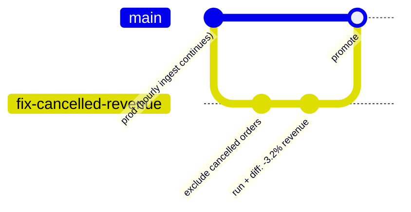
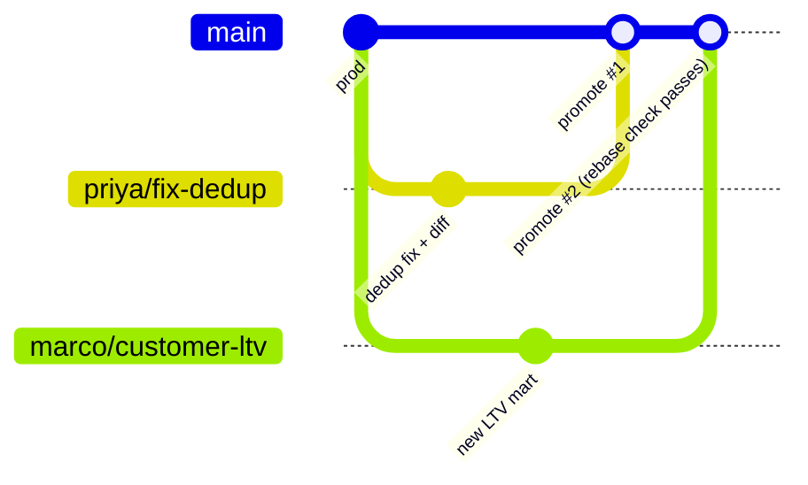

# Real Workflows

Four scenarios every data engineer has lived through — and what they look like with
branches. All CLI output below is the real tool's output format.

The example warehouse for all four:

```
raw.orders            ← ingested hourly by Airbyte
raw.customers         ← ingested nightly
stg_orders            ← staging model
stg_customers         ← staging model
fct_revenue_daily     ← the table finance actually looks at
mart_exec_dashboard   ← reads fct_revenue_daily
```

---

## 1. "Finance says revenue is wrong" — changing a metric definition

Cancelled orders are being counted as revenue. The fix is one line in `stg_orders` —
but `fct_revenue_daily` and `mart_exec_dashboard` are downstream, and finance will
ask exactly one question: *how much does this change the numbers?*



```console
$ vim models/stg_orders.sql        # ... WHERE status != 'cancelled'

$ reble branch create fix-cancelled-revenue
Created branch fix-cancelled-revenue
  scope (inferred from your changes): stg_orders, fct_revenue_daily, mart_exec_dashboard
  pins  (2): raw.customers, raw.orders
Switched to fix-cancelled-revenue
```

Notice what you didn't do: enumerate the downstream cascade. Reble read it off the
SQLMesh graph — your one-line edit touches three tables, and the two raw inputs are
pinned so hourly ingestion can't shift your numbers mid-analysis.

```console
$ reble run
Environment: fix_cancelled_revenue
  mirrored inputs : raw.customers, raw.orders
  models changed  : stg_orders, fct_revenue_daily, mart_exec_dashboard
  published       : stg_orders, fct_revenue_daily, mart_exec_dashboard

$ reble diff
Branch fix-cancelled-revenue vs base:

  stg_orders
    rows: 1,204,331 -> 1,168,210
    +0 added   -36,121 removed   ~0 changed

  fct_revenue_daily
    rows: 730 -> 730
    +0 added   -0 removed   ~214 changed
```

There's finance's answer, before anything touched prod: **36,121 cancelled orders
excluded, revenue restated on 214 of 730 days.** Screenshot the diff, get the
sign-off, then:

```console
$ reble promote
Promoted branch fix-cancelled-revenue to main:
  stg_orders
  fct_revenue_daily
  mart_exec_dashboard
Back on main
```

**Without branches:** you'd have run this in a shared dev schema (numbers drifting
under you with every hourly ingest), eyeballed two spreadsheet exports, and pushed to
prod hoping.

---

## 2. Building a brand-new mart (greenfield, branch-first)

You're starting `mart_weekly_retention`. Nothing downstream exists yet, so there's
nothing to diff against — the risks are different: your inputs drifting while you
iterate, and a half-finished table leaking into prod where the BI tool will find it.

Branch first, git-style, *before* writing any SQL:

```console
$ reble branch create weekly-retention
Created branch weekly-retention (branch-first: no changes yet)
  scope: open — grows automatically when you edit models and `reble run`
  reads: every table frozen as of this moment (the branch epoch)
Switched to weekly-retention
```

Now iterate. Twenty runs over three days while prod ingests hourly — every run
computes against the same Tuesday-9am inputs, so when the retention curve changes,
it's because *your SQL* changed:

```console
$ vim models/mart_weekly_retention.sql
$ reble run
Environment: weekly_retention
  models changed  : mart_weekly_retention
  published       : mart_weekly_retention

$ reble diff
Branch weekly-retention vs base:

  mart_weekly_retention  (new table — profile)
    rows: 52
    cohort_week: date
    customers: int64
    retained_w1: double
    retained_w4: double, 3 nulls
```

A profile, not a diff — there's no "before" for a new table. Those 3 nulls in
`retained_w4`? Caught here, not in the exec's dashboard. When it's right:

```console
$ reble promote
Promoted branch weekly-retention to main:
  mart_weekly_retention
Back on main
```

The moment it promotes, the new mart is registered in the lineage graph — so the
*next* person who touches `stg_customers` gets warned that your mart reads it.

---

## 3. Two engineers, two branches, zero coordination

Priya is fixing order dedup in `stg_orders`. Marco is building `mart_customer_ltv`.
Neither knows what the other is doing. Neither needs to.



Their scopes are disjoint — Priya's refs on `stg_orders`+downstream, Marco's on his
new mart — so they work in parallel all week. Promotes go one at a time. Priya
promotes first. When Marco promotes, Reble checks: *do any of Marco's models read the
tables Priya changed?*

- **No** → Marco's promote fast-forwards, done.
- **Yes** (his LTV mart reads `stg_orders`) → promote refuses with instructions:
  rerun against the new main, re-validate, then promote. Never a silent data merge.

The overlap case is caught even earlier — at *creation*:

```console
$ reble branch create also-touching-orders
  ...
  warning: stg_orders is also scoped by branch 'priya/fix-dedup' —
  second promote will require a rebase
```

**Without branches:** Priya and Marco share a dev schema, clobber each other's
tables, and coordinate via Slack messages that start with "hey, are you using...".

---

## 4. The save — a bad change that never reached prod

You "simplify" a join in `stg_orders`. The SQL looks obviously correct. Reviewer
would have approved it.

```console
$ reble branch create simplify-join
$ reble run
$ reble diff
Branch simplify-join vs base:

  stg_orders
    rows: 1,204,331 -> 1,983,507
    +779,176 added   -0 removed   ~0 changed
```

**A 65% row explosion.** The "simplified" join fans out on duplicate customer keys.
On a laptop, on frozen inputs, in a branch nobody else can see:

```console
$ reble branch delete simplify-join
Deleted branch simplify-join
```

Nothing to roll back, nothing to explain in the incident channel, no backfill. The
branch cost ~0 bytes to create and one command to destroy.

**Without branches:** this ships Friday, the weekend batch triples revenue,
and Monday starts with an incident review. Every data engineer has *been* this
scenario — branch-per-change is how it stops recurring.

---

## The pattern

All four are the same loop:

```
(edit ↔ branch, either order)  →  run  →  diff or profile  →  promote or discard
```

- Branch = metadata only (zero-copy Iceberg refs + a frozen epoch). Creating one is
  free; deleting one is guilt-free.
- Inputs never drift under you; prod is never at risk; the diff answers the question
  reviewers actually ask.
- Coming next: the [branch-per-PR GitHub Action](architecture.md#1-product-shape)
  that runs this loop on every pull request automatically.
